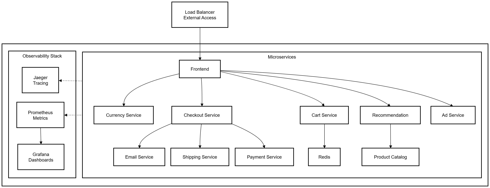
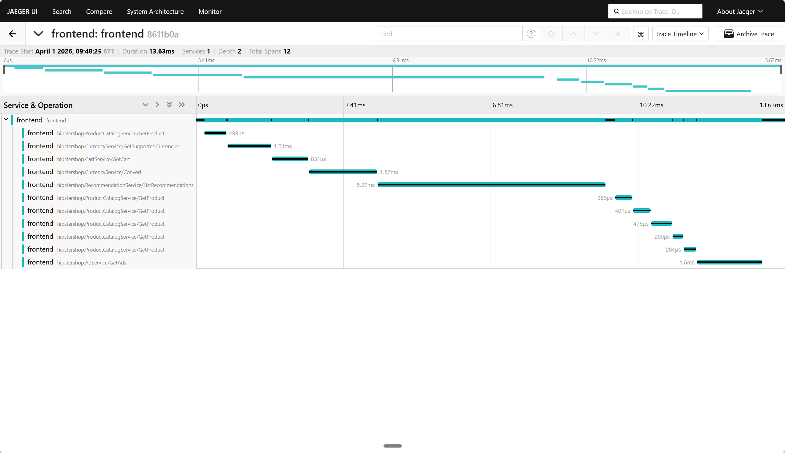
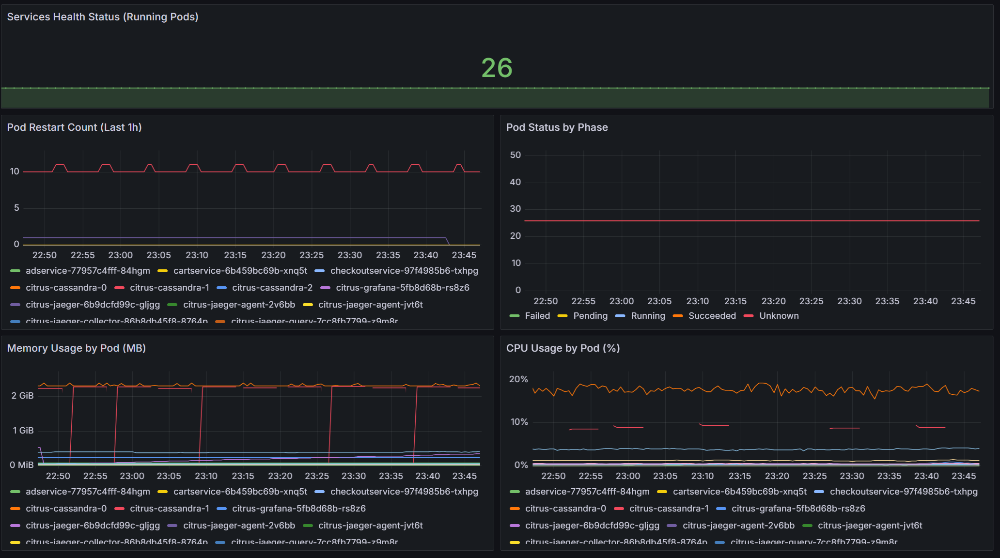
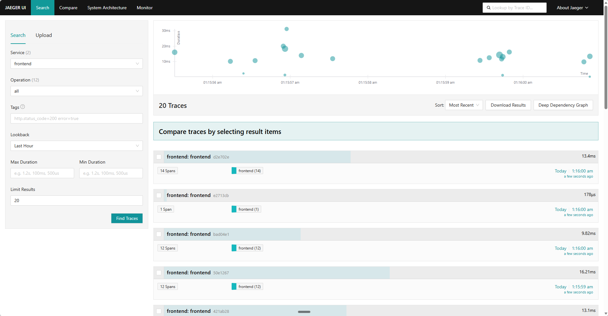

# Citrus-Orchestrator

Production-grade microservices platform with automated MLOps and AI-powered operations.

[](https://kubernetes.io/)
[](https://helm.sh/)
[](https://azure.microsoft.com/en-us/products/kubernetes-service/)

**Project Highlights:**

- 11-service microservices platform deployed on Azure AKS with under 10 minute deployment time
- Automated canary deployment with intelligent rollback based on real-time SLO metrics
- AI-powered incident analysis using Google Gemini
- 80% Docker image size reduction through multi-stage builds
- Migrated from GKE to AKS, solving RBAC and networking compatibility issues

---

## Overview

This project demonstrates production-grade DevOps engineering through a complete microservices deployment pipeline. The platform uses Google's microservices-demo application as the base workload, with all infrastructure, automation, and operational tooling built from scratch.

**What I Built:**

Infrastructure & Deployment:
- Complete Helm chart architecture with 800+ lines of templates
- Multi-stage Dockerfiles reducing image sizes by 80%
- GitHub Actions CI/CD pipeline with smart path detection
- Azure AKS deployment solving GKE RBAC migration challenges

Observability & Monitoring:
- Distributed tracing integration (Jaeger) with custom gRPC configuration
- Full metrics stack (Prometheus + Grafana) with 23 ServiceMonitors
- SLI/SLO dashboard with 99.9% uptime tracking
- 5-hour debugging session to solve memory isolation in tracing architecture

MLOps & Automation:
- Automated canary deployment script (465 lines Python)
- Intelligent rollback based on error rate and latency thresholds
- AI-powered incident analysis using Google Gemini (398 lines Python)
- Integration with Prometheus Alertmanager for automated response

**Base Application:**

The 11 microservices (frontend, cart, checkout, payment, etc.) are from [Google's microservices-demo](https://github.com/GoogleCloudPlatform/microservices-demo), used under Apache License 2.0. This project focuses on the operational layer: deployment automation, observability, and AI-driven operations rather than application development.

---

## Architecture



**Technology Stack**

Container Orchestration: Kubernetes 1.28+
Package Management: Helm 3.12+
Distributed Tracing: Jaeger (All-In-One with gRPC)
Metrics & Monitoring: Prometheus + Grafana
CI/CD: GitHub Actions with Docker Buildx
AI Integration: Google Gemini API
Cloud: Azure AKS, GKE (migration experience)

**Skills**

```
DevOps: Kubernetes, Helm, Docker, CI/CD, Infrastructure as Code
Observability: Prometheus, Grafana, Jaeger, Distributed Tracing, SLI/SLO
MLOps: Canary Deployment, A/B Testing, Automated Rollback
AIOps: AI-Driven Root Cause Analysis, Intelligent Incident Response
Languages: Python, Go, YAML, Bash/PowerShell
Cloud: Azure AKS, Multi-Cloud Architecture, Cost Optimization
```

---

## Quick Start

### Prerequisites

```bash
kubectl 1.28+
helm 3.12+
Azure CLI (for AKS)
Python 3.12+ (for MLOps scripts)
```

### Deployment

```bash
# Clone repository
git clone https://github.com/zihanKuang/Citrus-Orchestrator.git
cd Citrus-Orchestrator

# Deploy to AKS
helm install citrus ./deploy/helm/citrus-app \
  --namespace citrus \
  --create-namespace

# Wait for pods (2-3 minutes)
kubectl wait --for=condition=ready pod --all -n citrus --timeout=300s

# Get frontend IP
kubectl get svc frontend -n citrus -o jsonpath='{.status.loadBalancer.ingress[0].ip}'
```

### Advanced Workflows

```bash
# Canary deployment with automated rollback
python scripts/canary-deploy.py \
  --service recommendationservice \
  --baseline ghcr.io/zihankuang/citrus-recommendation:v1.0 \
  --canary ghcr.io/zihankuang/citrus-recommendation:v1.1

# AI-powered incident analysis
export GEMINI_API_KEY="your-key"
python scripts/aiops-agent.py --mode server --port 5000
```

### Access Services

```bash
# Jaeger (Distributed Tracing)
kubectl port-forward svc/citrus-jaeger-ui 16686:16686 -n citrus
# http://localhost:16686

# Grafana (Metrics Dashboard)
kubectl port-forward svc/citrus-grafana 3000:80 -n citrus
# http://localhost:3000 (admin/prom-operator)
```

---

## Project Structure

```
Citrus-Orchestrator/
├── .github/workflows/
│   ├── ci.yaml                 
│   └── ci-cd-full.yaml         # Full CI/CD pipeline
├── deploy/
│   ├── grafana/
│   │   └── recommendation-slo-dashboard.json
│   └── helm/citrus-app/
│       ├── Chart.yaml
│       ├── values.yaml
│       └── templates/
│           ├── all-in.yaml
│           ├── servicemonitor.yaml
│           ├── hpa.yaml
│           └── _helpers.tpl
├── scripts/
│   ├── canary-deploy.py       # MLOps automation
│   ├── aiops-agent.py         # AI incident analysis
│   └── requirements.txt
├── src/                       # 11 microservices
│   ├── frontend/Dockerfile    # Optimized multi-stage
│   ├── recommendationservice/Dockerfile
│   └── ... (9 more services)
├── TROUBLESHOOTING.md
└── README.md
```

---

## Critical Issues Solved

### 1. Distributed Tracing Architecture

**Problem:** Traces were sent successfully but never appeared in the Jaeger UI.

**Root Cause:** Multi-instance architecture (separate Collector, Query, and Agent pods) had memory isolation. Each pod maintained independent in-memory storage with no shared backend, so traces sent to Collector were invisible to Query UI.

**Solution:**
- Migrated to All-In-One Jaeger deployment
- Switched from HTTP/protobuf to gRPC (port 4317) to fix path duplication bug (`/v1/traces/v1/traces`)
- Added non-standard `ENABLE_TRACING=1` environment variable after analyzing Frontend source code
- Frontend image ignores standard OTEL variables and requires custom `COLLECTOR_SERVICE_ADDR`

**Technical debt:** All-In-One suitable for <100 req/s; distributed mode with Elasticsearch backend needed for production scale.

### 2. Cross-Cloud Migration (GKE to AKS)

**Problem:** RBAC permission conflicts prevented GitLab CI from deploying to GKE Autopilot.

**Investigation:**
- `403 Forbidden` errors on Kubernetes API calls despite correct service account configuration
- Node Exporter failed due to GKE Autopilot blocking `hostPath` mounts
- Prometheus installation blocked by webhook validation errors (`x509: certificate signed by unknown authority`)

**Solution:**
- Complete migration to Azure AKS Standard
- Disabled admission webhooks: `admissionWebhooks.enabled: false`
- Cleaned residual `validatingwebhookconfigurations` manually
- Rebuilt ServiceMonitor discovery with `serviceMonitorNamespaceSelector: {}`

**Result:** Deployment time reduced from "never completes" to 10 minutes.

### 3. Memory Exhaustion (OOMKilled)

**Problem:** AI Agent pod crashed repeatedly with `OOMKilled` status.

**Analysis:** Python runtime + google-generativeai library consumed 400MB+, but container only allocated 128MB.

**Solution:**
- Increased memory limit to 512Mi
- Added proper `requests` configuration for HPA compatibility
- Implemented Prometheus monitoring for resource usage

### 4. Service Discovery Failures

**Problem:** Frontend returned 500 errors when calling CartService despite both pods running.

**Multi-layered debugging:**
- Port mismatch: Container expected 7070 not 8080
- Missing dependency: CartService failed silently without `REDIS_ADDR` environment variable
- Azure CNI networking: Headless services (ClusterIP: None) broke port-forwarding
- Label mismatch: ServiceMonitor couldn't discover targets

**Solution:**
- Manually exposed services with `kubectl expose` using explicit ClusterIP
- Standardized label schema across all deployments
- Added proper environment variable injection via Helm templates

### 5. Autoscaling Phantom Load

**Problem:** Load generator pod was running but HPA showed `<unknown> / 50%` and no pods scaled.

**Root Cause:** Missing `FRONTEND_ADDR` environment variable meant load generator was sending requests to nowhere.

**Fix:** Added environment variable injection in Helm templates. Result: Successfully triggered autoscaling from 2 to 4 pods when CPU exceeded 60%.

---

## Technical Decisions

**All-In-One Jaeger vs Distributed**

All-In-One chosen to avoid Cassandra/Elasticsearch costs. Azure AKS cluster costs $150/month for 2 nodes; adding database backend would double it. All-In-One acceptable for workloads under 100 req/s. Migration path to distributed mode documented for production scaling.

**gRPC vs HTTP for Tracing**

HTTP/protobuf mode caused path duplication bug where SDK appended `/v1/traces` to endpoint already containing `/v1/traces`, resulting in malformed URLs. Jaeger silently dropped these requests. gRPC provides better type safety and debugging.

**Manual Environment Variable Injection**

Google's original container images expect GCP-specific variables (`PROJECT_ID`, `REGION`). Code uses `os.environ[]` which raises KeyError if variables missing, rather than `.get()` with defaults. Helm templates inject placeholder values to prevent crashes. Alternative would require forking and patching all 11 services.

---

## Screenshots

### Distributed Tracing



Real trace showing Frontend calling 12 backend services with complete latency breakdown. End-to-end request time: 13.63ms with per-service timing.

### Monitoring Dashboard



Grafana showing 26 running pods with real-time metrics: restart counts, memory usage, CPU utilization, pod status by phase.

### Trace Search



Jaeger UI showing 20+ captured traces with search and filtering. Demonstrates complete observability coverage.

**Current deployment:**
- 24 pods running on Azure AKS
- 23 ServiceMonitors active (Prometheus auto-discovery)
- 99.9% uptime SLO tracked via Grafana
- AI analysis operational (Gemini integration)

---

## Observability

### Distributed Tracing (Jaeger)

Visualizes:
- End-to-end request latency across all services
- Service dependency graphs
- Error propagation and root cause
- Performance bottlenecks (slowest spans)

Example trace flow:
```
Frontend → AdService → RecommendationService → ProductCatalog
   ↓
CartService → Redis
   ↓
CheckoutService → PaymentService → ShippingService
```

### Metrics (Prometheus)

Collected metrics:
- HTTP request duration (histogram)
- gRPC call latency
- Pod CPU/memory usage
- Container restart counts

23 ServiceMonitors deployed across all services.

---

## Documentation

- [Helm Chart README](deploy/helm/citrus-app/README.md) - Architecture decisions and configuration
- [TROUBLESHOOTING.md](TROUBLESHOOTING.md) - Complete debugging reference
- [values.yaml](deploy/helm/citrus-app/values.yaml) - Inline comments for all configuration options

Critical decisions documented inline:

```yaml
# Frontend requires non-standard environment variables
# Standard OTEL_EXPORTER_OTLP_ENDPOINT is ignored
- name: ENABLE_TRACING
  value: "1"
- name: COLLECTOR_SERVICE_ADDR
  value: "jaeger-grpc-solid:4317"
```

---

## Performance

**Current Resource Usage (11 services + observability):**
- Total CPU requests: 1200m (1.2 cores)
- Total memory requests: 2Gi
- Monthly cost: ~$150 USD (Azure AKS 2-node Standard_D2s_v3)

**Optimizations implemented:**
- Right-sized CPU/memory limits based on actual usage data
- Disabled profiler (5-10% CPU reduction)
- In-memory tracing (no database storage costs)

---

## Project Attribution

**Microservices Application Code:**

The 11 microservices (frontend, cart, checkout, payment, shipping, email, currency, product catalog, recommendation, ad service, load generator) are from [Google Cloud Platform's microservices-demo](https://github.com/GoogleCloudPlatform/microservices-demo), licensed under Apache License 2.0.

**My Contributions (DevOps & Infrastructure):**

All operational infrastructure and automation:
- Complete Helm chart architecture (`deploy/helm/citrus-app/`)
- Optimized Dockerfiles with multi-stage builds (`src/*/Dockerfile`)
- CI/CD pipeline (`.github/workflows/`)
- MLOps automation scripts (`scripts/canary-deploy.py`)
- AIOps incident analysis (`scripts/aiops-agent.py`)
- Observability configuration (Prometheus, Grafana, Jaeger)
- SLI/SLO dashboard (`deploy/grafana/`)
- Complete troubleshooting documentation
- GKE to AKS migration and compatibility fixes

This project demonstrates DevOps/SRE engineering capabilities using a realistic multi-service application as the workload. The focus is on deployment automation, observability, and intelligent operations rather than application development.

