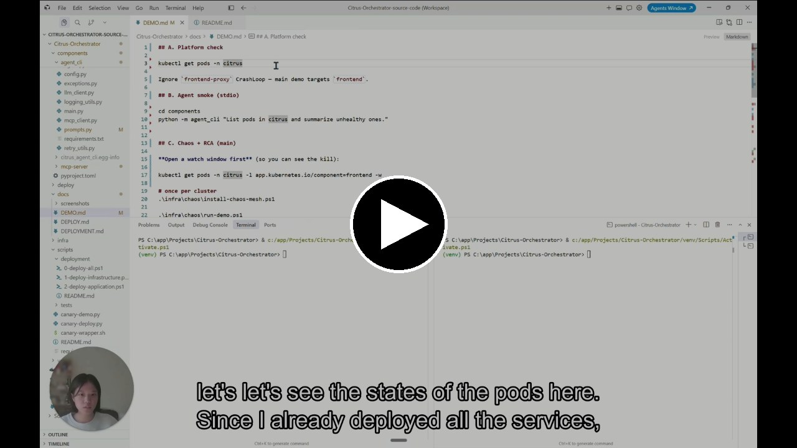

# Citrus-Orchestrator

## Demo

Chaos kill → K8s self-heal → Agent RCA + recovery validation

[](docs/assets/demo-walkthrough.mp4)

---

Local Kubernetes platform for progressive delivery, observability, and Agentic SRE diagnostics.

Workload: [OpenTelemetry Demo](https://github.com/open-telemetry/opentelemetry-demo) (Helm).  
Ops layer (this repo): monitoring stack, canary tooling, MCP server, hand-written ReAct agent CLI, Chaos Mesh demos.

## What this repo is

| Layer | What | Where |
|-------|------|--------|
| Target app | otel-demo microservices | `deploy/helm/otel-demo-values.yaml` |
| Observability | Prometheus, Grafana, Jaeger | `deploy/helm/*`, `scripts/deployment/` |
| Canary / MLOps | metric-based deploy + rollback | `scripts/canary-*.py` |
| MCP server | K8s/Prometheus tools over MCP | `components/mcp-server/` |
| Agent CLI | ReAct loop + Gemini tool calling | `components/agent_cli/` |
| Chaos | PodChaos + demo scripts | `infra/chaos/` |
| RBAC / deploy | least-privilege SA + manifests | `infra/rbac/`, `infra/manifests/` |

**Transports**
- Local default: Agent spawns MCP over **stdio**
- Optional: MCP **Streamable HTTP** in-cluster (`--transport streamable-http`, Service + Bearer token)

## Quick start

### Prerequisites

- kubectl, Helm 3, a local cluster (Kind / Docker Desktop / Minikube)
- Python 3.12+, `GEMINI_API_KEY` for the agent

### 1. Deploy platform

```powershell
.\scripts\deployment\0-deploy-all.ps1
```

Or step by step:

```powershell
.\scripts\deployment\1-deploy-infrastructure.ps1
.\scripts\deployment\2-deploy-application.ps1
```

Port-forwards (examples):

```powershell
kubectl port-forward -n citrus svc/otel-demo-frontendproxy 8080:8080
kubectl port-forward -n citrus svc/monitoring-grafana 3000:80
kubectl port-forward -n citrus svc/monitoring-kube-prometheus-prometheus 9090:9090
kubectl port-forward -n citrus svc/jaeger 16686:16686
```

### 2. Run the Agent (stdio)

One-time setup (per venv / machine):

```powershell
cd components
copy agent_cli\.env.example agent_cli\.env
# edit agent_cli\.env → set GEMINI_API_KEY=
pip install -e ".[test]"
pip install -e "mcp-server[test]"
```

Then run:

```powershell
cd components
python -m agent_cli "What is the status of frontend pods in citrus?"
```

`python -m agent_cli` needs those editable installs. `pip install -r .../requirements.txt` alone is not enough (you get `No module named mcp` / `agent_cli`).

### 3. Chaos + diagnosis demo

```powershell
.\infra\chaos\install-chaos-mesh.ps1   # once
.\infra\chaos\run-demo.ps1
cd components
python -m agent_cli "What happened to the frontend pods? RCA + validate recovery."
```

See [docs/DEMO.md](docs/DEMO.md) for the full interview demo path. Demo recording is at the top of this README.

### 4. Optional: HTTP MCP (in-cluster)

```powershell
# after building/loading image mcp-server:v4
kubectl apply -f infra/rbac/mcp-server-rbac.yaml
kubectl apply -f infra/manifests/mcp-server-secret.yaml
kubectl apply -f infra/manifests/mcp-server-service.yaml
kubectl apply -f infra/manifests/mcp-server-networkpolicy.yaml
kubectl apply -f infra/manifests/mcp-server-deployment.yaml
kubectl port-forward -n citrus svc/mcp-server 8080:8080

cd components
$env:MCP_AUTH_TOKEN="change-me-citrus-mcp"  # match Secret
python -m agent_cli --mcp-url http://127.0.0.1:8080/mcp "List pods in citrus"
```

## Layout

```
Citrus-Orchestrator/
├── components/
│   ├── agent_cli/          # ReAct agent (Brain)
│   └── mcp-server/         # MCP tools + HTTP/stdio (Hands)
├── deploy/helm/            # monitoring, jaeger, otel-demo values
├── infra/
│   ├── chaos/              # Chaos Mesh install + PodChaos
│   ├── manifests/          # MCP Deployment / Service / NetworkPolicy
│   └── rbac/               # read-only Role for MCP SA
├── scripts/
│   ├── deployment/         # PowerShell IaC deployers
│   └── canary-*.py         # canary + rollback automation
├── docs/
│   ├── DEMO.md
│   └── assets/demo-walkthrough.mp4
└── README.md
```